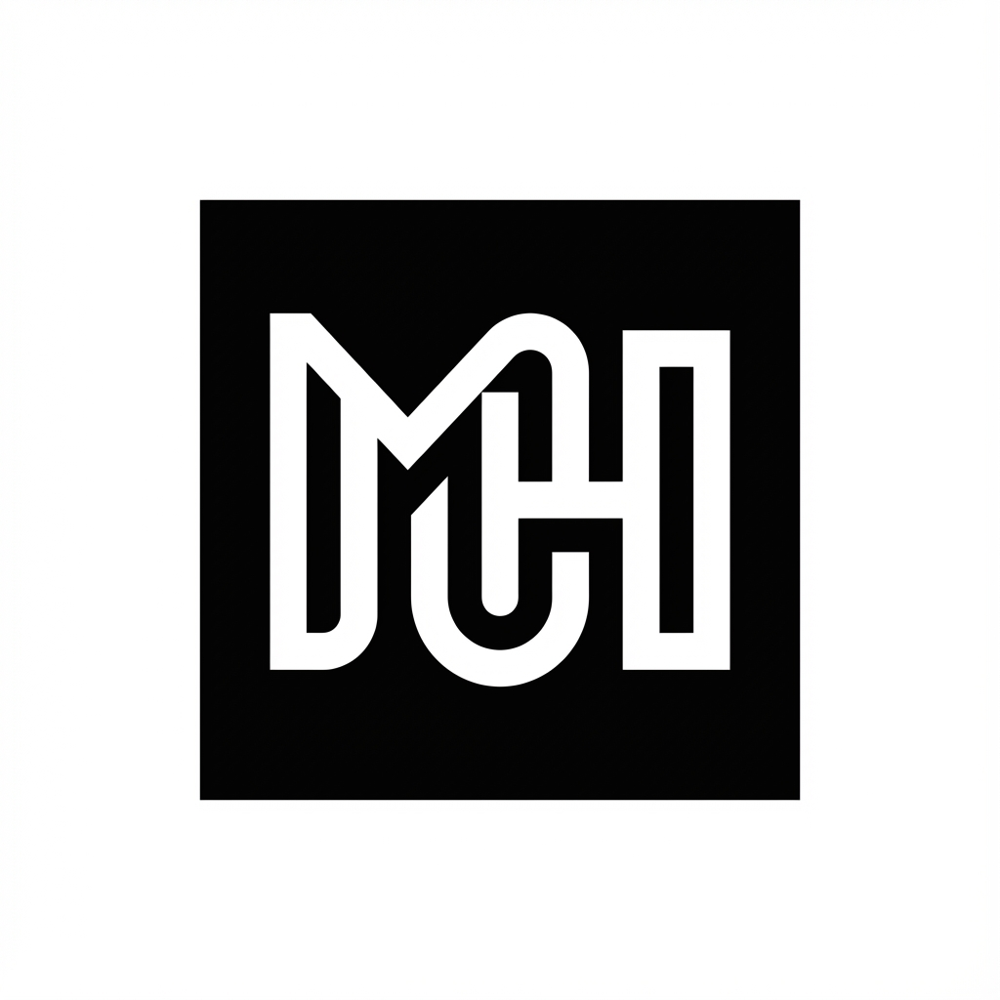

<div align="center">
  
  
  # Mohamed El Hedi Belghith - Portfolio

  ### Business Computing & Web/Mobile Developer
  
  [](https://netlify.com)
  [](https://developer.mozilla.org/en-US/docs/Web/HTML)
  [](https://developer.mozilla.org/en-US/docs/Web/CSS)
  [](https://developer.mozilla.org/en-US/docs/Web/JavaScript)
  [](https://threejs.org/)

  **A modern, responsive portfolio website showcasing my skills, projects, and experience in web development and AI.**


</div>

---

## 📸 Preview

<div align="center">
  
  <p><em>Clean, modern interface with smooth animations</em></p>
</div>

## ✨ Features

### 🎨 **Design & UX**
- **Sleek Black & White Theme** - Minimalist design with elegant typography
- **Dark/Light Mode Toggle** - Seamless theme switching with localStorage persistence
- **Smooth Animations** - Scroll-triggered animations using Intersection Observer
- **Glassmorphism Effects** - Modern UI with backdrop blur
- **Responsive Design** - Fully responsive across all devices (mobile, tablet, desktop)

### 🚀 **Interactive Elements**
- **3D Background** - Three.js particle system with rotating wireframe icosahedron
- **Mouse Parallax** - Interactive 3D background that follows cursor movement
- **Vertical Carousel** - Custom scroll-snap certification showcase
- **Hover Effects** - Smooth transitions on cards, buttons, and links
- **Mobile Navigation** - Animated hamburger menu for mobile devices

### 📱 **Sections**
- **Hero** - Eye-catching introduction with call-to-action buttons
- **About Me** - Professional summary with language proficiencies
- **Skills** - Categorized technical skills (Frontend, Backend, AI/ML, Tools)
- **Certifications** - Vertical scrolling carousel with certificate images
- **Education** - Timeline-based education history
- **Experience** - Professional experience cards
- **Projects** - Showcase of key projects with tech stack
- **Student Life** - Associative activities and club memberships
- **Contact** - Contact form with social media links
- **Visitor Counter** - Simple view counter using localStorage

## 🛠️ Tech Stack

<div align="center">

| Category | Technologies |
|----------|-------------|
| **Frontend** | HTML5, CSS3, Vanilla JavaScript |
| **3D Graphics** | Three.js (r128) |
| **Fonts** | Google Fonts (Outfit) |
| **Icons** | Custom SVG Icons |
| **Hosting** | Netlify (recommended) |

</div>

## 📂 Project Structure

```
portfolio/
├── index.html          # Main HTML file
├── style.css           # Custom CSS styles
├── script.js           # JavaScript logic & Three.js
├── favicon.png         # Custom MH logo favicon
├── assets/             # Images and certificates
│   ├── cert_nvidia_nlp.png
│   ├── cert_nvidia_dl.png
│   ├── cert_datacamp_rag.png
│   ├── cert_datacamp_python.png
│   └── cert_datacamp_llama.png
└── README.md           # This file
```

## 🚀 Quick Start

### Prerequisites
- A modern web browser (Chrome, Firefox, Safari, Edge)
- Optional: Node.js for local development server

### Installation

1. **Clone the repository**
   ```bash
   git clone https://github.com/Hedi-bel/portfolio.git
   cd portfolio
   ```

2. **Open locally**
   
   **Option A: Direct File**
   ```bash
   # Simply open index.html in your browser
   start index.html  # Windows
   open index.html   # macOS
   ```

   **Option B: Local Server (Recommended)**
   ```bash
   # Using Python
   python -m http.server 3000
   
   # Using Node.js
   npx http-server -p 3000 -o
   
   # Using PHP
   php -S localhost:3000
   ```

3. **Visit** `http://localhost:3000`

---

## 🎨 Customization

### Change Colors
Edit CSS variables in `style.css`:
```css
:root {
    --bg-color: #050505;      /* Background */
    --text-color: #ffffff;    /* Text */
    --accent: #ffffff;        /* Accent color */
    --card-bg: #0a0a0a;      /* Card background */
}
```

---

## 📊 Performance

- ⚡ **Lighthouse Score**: 95+ Performance
- 🎯 **First Contentful Paint**: < 1.5s
- 📦 **Total Size**: ~50KB (minified)
- 🌍 **CDN**: Three.js loaded from CDN

## 🤝 Contributing

Contributions are welcome! Feel free to:
1. Fork the project
2. Create your feature branch (`git checkout -b feature/AmazingFeature`)
3. Commit your changes (`git commit -m 'Add some AmazingFeature'`)
4. Push to the branch (`git push origin feature/AmazingFeature`)
5. Open a Pull Request


## 📧 Contact

**Mohamed El Hedi Belghith**

- 📧 Email: medhedi123j@gmail.com
- 💼 LinkedIn: [mohamed-el-hedi-belghith](https://www.linkedin.com/in/mohamed-el-hedi-belghith/)
- 🐙 GitHub: [@Hedi-bel](https://github.com/Hedi-bel)
- 📱 Phone: +216 53 086 314
- 📍 Location: Ariana, Tunisia

## 🙏 Acknowledgments

- [Three.js](https://threejs.org/) - 3D graphics library
- [Google Fonts](https://fonts.google.com/) - Outfit font family
- [Unsplash](https://unsplash.com/) - High-quality images
- [Shields.io](https://shields.io/) - README badges

---

<div align="center">
  
  
  **Made with ❤️ by Mohamed El Hedi Belghith**
  
  ⭐ Star this repo if you like it!
</div>
